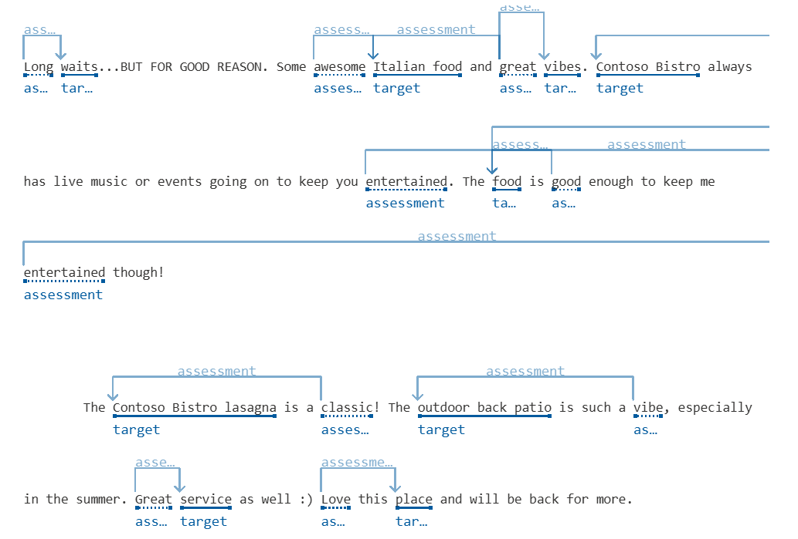
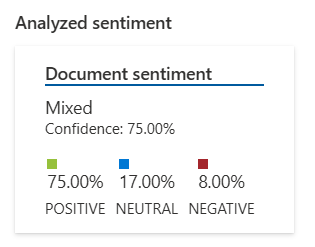
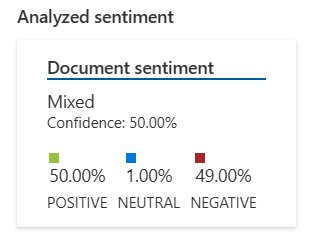
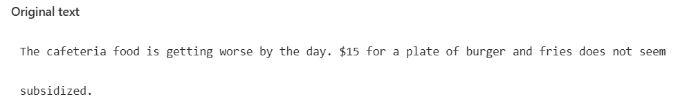
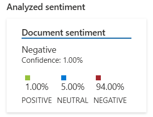

# Desafio de projeto - Módulo Serviços em Cloud com Foco em IA

# Sentença 1

*Long waits...BUT FOR GOOD REASON. Some awesome Italian food and great vibes. Contoso Bistro always has live music or events going on to keep you entertained. The food is good enough to keep me entertained though!  
The Contoso Bistro lasagna is a classic! The outdoor back patio is such a vibe, especially in the summer. Great service as well :) Love this place and will be back for more.*

**Análise:**

**Resultado:**

**Insights:**

É interessante notar que um comentário pode até começar com algo negativo, como "long waits", mas ainda ser interpretado de forma positiva dependendo do contexto e da explicação que o acompanha. Conectivos como "but" e "though" têm um papel importante nisso, pois conseguem suavizar ou até inverter o tom da frase.

Além disso, elementos como emojis e expressões mais informais, como ":)" ou "Love this place", contribuem para dar um tom mais leve e entusiasmado à mensagem.

Tudo isso mostra como a análise de sentimentos pode ser uma ferramenta poderosa, especialmente para empresas que querem compreender melhor a percepção dos clientes. Também é uma ótima maneira de treinar algoritmos para interpretar comentários mistos com mais precisão e evitar interpretações equivocadas.

 
 

# Sentença 2

*My name is Mateo Gomez and I visited Contoso Restaurant with my spouse for our anniversary last Thursday. I had heard wonderful things about your food and service from my neighbors as I lived right down the street from you at 1234 Hollywood Boulevard.  
After a lovely stroll along the Santa Monica Pier, we decided to go for dinner at Contoso. But when we got to the restaurant, we had to wait for 15 minutes just to get on the waiting list. After an hour of waiting to get seated, we ordered two Surf and turf platters. To our absolute surprise, the food was very cold and dry.  
The whole experience was just awful, and I expect a refund for our meal and an apology for that day. Please issue me a refund at the earliest and call me on 123-456-7890 for any further questions.*

**Análise:**

**Resultado:**

**Insights:**

Fica claro que esse comentário tem um tom bastante negativo, principalmente porque o cliente tinha expectativas altas e acabou se decepcionando. Ele começa mencionando que já havia ouvido boas recomendações sobre o restaurante — algo que poderia sugerir um tom neutro ou até positivo — mas isso muda drasticamente quando ele relata a longa espera e a má qualidade da comida.

Expressões como "very cold and dry", "the whole experience was just awful" e "I expect a refund" evidenciam o grau de insatisfação. Além disso, o tom usado é mais formal e direto ao exigir um reembolso e um pedido de desculpas, o que reforça a seriedade da reclamação.

Esse tipo de análise é útil para que as empresas identifiquem rapidamente feedbacks negativos e possam tomar medidas para resolver a situação. Também serve para treinar algoritmos a distinguirem críticas construtivas de reclamações mais graves que pedem uma resposta imediata.
 
 

# Sentença 3

*The cafeteria food is getting worse by the day. $15 for a plate of burger and fries does not seem subsidized.*

**Análise:**

**Resultado:**

**Insights:**

Esse comentário transmite um tom claramente negativo, já que o autor demonstra insatisfação tanto com a qualidade da comida quanto com o preço. A expressão "getting worse by the day" reforça a ideia de uma deterioração contínua, tornando a crítica ainda mais impactante.

A observação sobre o preço ("$15 for a plate of burger and fries does not seem subsidized") indica que o cliente esperava um valor mais acessível, possivelmente por se tratar de um refeitório que, na visão dele, deveria ter algum tipo de subsídio. Isso revela que a frustração vai além da comida, atingindo também a questão do custo.

Esse tipo de análise pode ajudar empresas a reavaliar preços ou investir na melhoria do serviço. Para a análise de sentimentos, é um bom exemplo de como identificar frustração e expectativas não atendidas com base na escolha das palavras e no tom do comentário.

